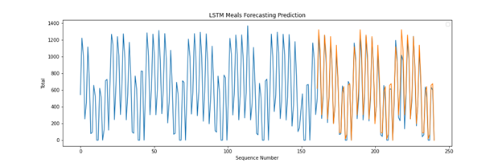
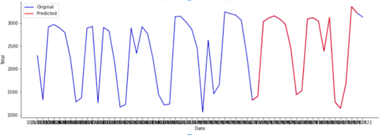

***Project Report #
Using LSTM To Predict Capacity for NJIT’s GDS,***

Nikhil Ramesh

Lazar Agoev

Sergio Torrico

Abstract: With the emergence of COVID-19 and the ever increasing importance of social distancing/capacity limits on indoor services, 
should COVID-19 rates ramp up again, it is extremely important to have an accurate prediction of current building capacity so that 
consumers can plan their visits accordingly. We attempted to solve this problem utilizing the ARIMA algorithm with NJIT’s very own 
GDS in order to produce an accurate estimate of capacity percentage based on the day of the week and current meal time period. 

Introduction: The problem we tackled in this project was the fact that NJIT does not have a readily accessible resource for students 
to know how busy GDS is during the day. There are similar services available for the WEC and Honors Gym in order to prevent too many 
students from entering indoor areas and therefore limiting the chance of COVID-19 spreading. If COVID-19 rates increase to the values 
they were at during the height of the pandemic it would only be reasonable to instate indoor limits on GDS so that too many students 
are not in the same room. Our prediction model is extremely important since it would provide an accurate estimate of GDS capacity 
and allow for students to know when they can visit the dining hall without extra risk of spreading COVID-19, which is an especially 
important topic considering the new omicron mutation of COVID-19. We tested our predictor by going to GDS in person and seeing if the 
amount of students in the dining hall was fairly accurate when compared with our prediction model.

Related Work: There are many similar projects that attempt to predict how busy a restaurant or store will be using various algorithms. 
One popular choice is to model two poisson simulations where one represents the entrance rate of customers per hour and the exit rate 
of customers per hour. Using this system, the current amount of people in GDS could be calculated simply by taking the differences of 
the predicted rates. One resource that we used heavily to research various prediction models can be found at the following link: 
https://towardsdatascience.com/5-machine-learning-techniques-for-sales-forecasting-598e4984b109. This article discusses how “LSTM is a 
type of recurrent neural network that is particularly useful for making predictions with sequential data” which is the perfect model for
our task. We attempted to utilize LSTM that is commonly used for sales prediction with various tweaks in order to attune the model for 
our specific model.

Data: The data we used to train our model was a mix of collected data and data provided by the head of Gourmet Dining at NJIT. The system 
that monitors students entering GDS by Gourmet Dining splits the day into four different periods: Period 1: 7am-10:30 am, 
Period 2: 10:30am-3:30pm, Period 3: 3:30-8:00pm, and Period 4: 8:00pm-10:00pm. If you look at the appended CSV file it is clear that 
there are 0 values, specifically on Saturday Period 4 and Sunday Periods 1 and 4 since the hours of operation for GDS are different on 
weekends. The data provided by GDS with gaps was around two months worth of data, or 60 days of data. If each day was independent of 
student rate, this would have been more than enough data to train our model. However, it is important to consider that the day of the 
week heavily correlates with what hour certain students will be utilizing the dining hall. For example, GDS has different hours on the 
weekends than weekdays, certain days have more scheduled classes and therefore less GDS activity for those respective time periods. With 
this being known, it was necessary to train the model with the fact that the day itself is also a determining variable therefore requiring 
more data to properly train the model. In order to supplement data for each day, the data had to be split by day of the week, effectively 
dividing our sample size by 7. We had two months of data (60 days) with 4 meal periods each day resulting in 240 data points which were then 
split into 80 data points used for testing and 160 data points used for training. We also had to do quite a bit of preprocessing on the data. 
The CSV file had to be specifically formatted utilizing meal period and weekday as indices for the predicted output. The differences between 
file format before and after preprocessing can be seen in the following screenshots of the data head provided below:

Original CSV Datafile:

Preprocessed CSV Datafile:

Methods: After reading material on sales forecasting and other related algorithms it was clear that Poisson simulation and ARIMA were not quite 
fit for the task we had at hand. Therefore, out of the researched models, we selected to use LSTM (Long Short-Term Memory) in order to accurately 
predict future meal periods based on those we were provided from the GDS data system. We believe that our approach to solving the problem was the 
most accurate data model representation since we have done research on various algorithms for similar situations and selected the most applicable 
model in order to complete our specific problem.
 

The above graph shows the corresponding meal period prediction values for each day of the week. For example the graph labeled Monday at Index 2 
represents the predicted value of meal swipes on monday for the time period 10:30am-3:30pm. When we graph these predicted values compared to the 
ground truth values the following graph is produced: 
 

The above graph shows the blue line for the ground truth data recorded via the GDS meal period system while the orange line represents our LSTM model’s 
predictions for each respective meal period. Utilizing the Sklearn module’s mean_squared_error, mean_absolute_error, and r2_score metric it shows that 
our data has a R2 correlation coefficient in the range of .93-.99 and an average of approximate .96 when ran with epoch of size 200. Therefore it shows 
that our models prediction values are heavily correlated with the ground truth dataset values.

Experiments: In order to verify that our approach solves the problem we used three main strategies: empirical checking, data ablation, and data visualization. 
The first being to empirically check our data by going to GDS in person and recording roughly how busy it was and comparing that to our model’s prediction. 
Unfortunately the results of our first experiment were not accurate since it was Thanksgiving Break by the time we finished our predictor model and therefore 
the current data values of the week 11/22-11/28 are effectively outliers. The second strategy was an ablation study. We mentioned how it was important to factor 
in the actual day of the week due to its influence on current capacity. This is further supported by the ablation study where we utilized the model without day 
distinction and got extremely inaccurate results which can be seen by the screenshot of our original data model below:

 
 
Lastly, we checked our data prediction model using data visualization. As mentioned above in the data section, the following graph provides adequate evidence to 
show the correlation between our predicted values and the ground truth values:

 

Conclusion: The model did an excellent job at predicting the meal swipes per dining period when compared with the data provided by GDS. For example, selecting a 
random week from the ground truth data compared to our predictor data the margin of error was the following for each respective day (Monday-Sunday) were: 2.84%, 
9.43%, 10.76%, 5.37%, 5.41%, 4.06%, and 1.97% totaling in a weekly error margin of 5.69%. Some future ideas to expand upon this project in order to make the model 
more accurate/more properly solve the problem discussed in our proposal include:

●	Access a larger GDS dataset of at least 3 years in order to properly account for outliers that occur yearly, such as holidays, campus breaks, and other special events.

●	Receiving more precise data in order to create more precise predictions. For example, if we decrease the time periods from the aforementioned four time periods to 
hourly data, the model could accurately predict and therefore solve the original problem mentioned in our proposal.

●	Having access to more information from the GDS backboard system such as how many people are currently enrolled at NJIT and the current capacity for the continuous 
dining hall. This would have allowed for us to properly implement our percentage system that would be used for indoor capacities during a new wave of COVID-19.

●	We would also compare our predicted data with the corresponding weeks in the future in order to get a complete comparison of predicted data to ground truth data instead 
of predicted data to past data.

During this project we learned how to utilize the various functionalities of the Keras library in order to create, train, and verify a machine learning Long Short-Term Memory 
model. Our model was able to successfully predict meal swipes with an R2 of approximately .96. 
